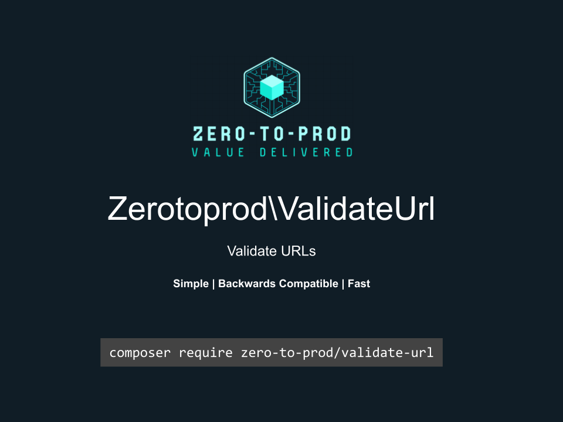

# Zerotoprod\ValidateUrl



[](https://github.com/zero-to-prod/validate-url)
[](https://github.com/zero-to-prod/validate-url/actions)
[](https://packagist.org/packages/zero-to-prod/validate-url/stats)
[](https://packagist.org/packages/zero-to-prod/validate-url/stats)
[](https://packagist.org/packages/zero-to-prod/validate-url)
[](https://github.com/zero-to-prod/validate-url/blob/main/LICENSE.md)

Validates a URL.

## Installation

Install the package via Composer:

```bash
composer require zero-to-prod/validate-url
```

## Usage

Returns true if the URL is valid.

If you would like to specify the URL protocols that should be considered valid,
pass an array of protocols.

```php
Zerotoprod\ValidateUrl\ValidateUrl::isUrl('https://www.example.com')
Zerotoprod\ValidateUrl\ValidateUrl::isUrl('https://www.example.com', ['https', 'udp'])
```