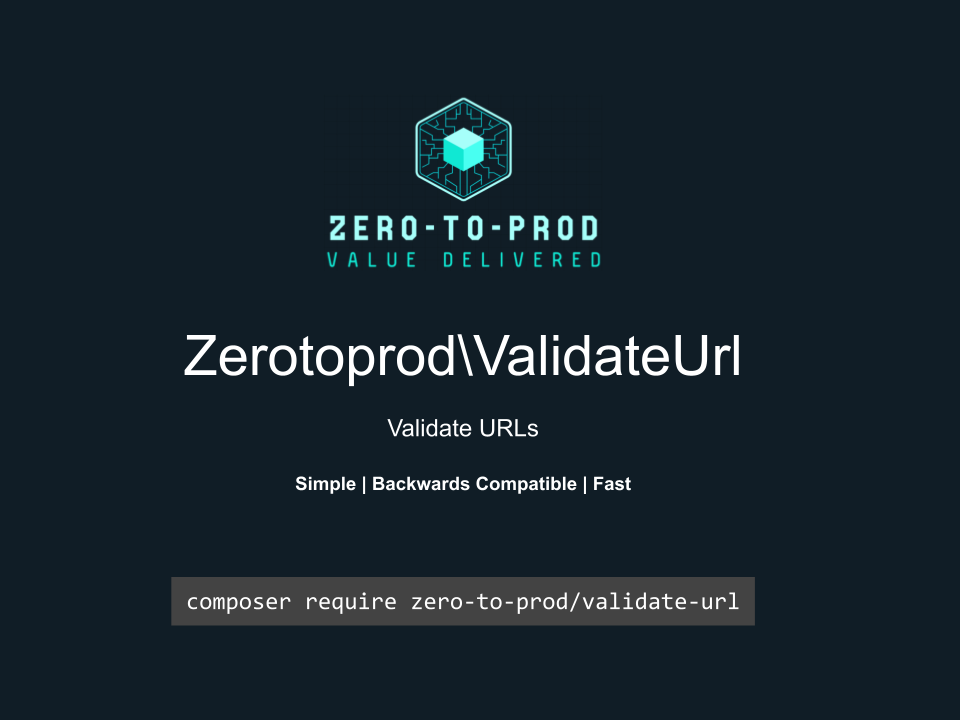

# Zerotoprod\ValidateUrl



[](https://github.com/zero-to-prod/validate-url)
[](https://github.com/zero-to-prod/validate-url/actions)
[](https://github.com/zero-to-prod/validate-url/actions)
[](https://packagist.org/packages/zero-to-prod/validate-url/stats)
[](https://packagist.org/packages/zero-to-prod/validate-url/stats)
[](https://packagist.org/packages/zero-to-prod/validate-url)
[](https://github.com/zero-to-prod/validate-url/blob/main/LICENSE.md)
[](https://wakatime.com/badge/github/zero-to-prod/validate-url)
[](https://hitsofcode.com/github/zero-to-prod/validate-url/view?branch=main)

## Contents

- [Introduction](#introduction)
- [Requirements](#requirements)
- [Installation](#installation)
## Documentation Publishing

You can publish this README to your local documentation directory.

This can be useful for providing documentation for AI agents.

This can be done using the included script:

```bash
# Publish to default location (./docs/zero-to-prod/validate-url)
vendor/bin/zero-to-prod-validate-url

# Publish to custom directory
vendor/bin/zero-to-prod-validate-url /path/to/your/docs
```

#### Automatic Documentation Publishing

You can automatically publish documentation by adding the following to your `composer.json`:

```json
{
  "scripts": {
    "post-install-cmd": [
      "zero-to-prod-validate-url"
    ],
    "post-update-cmd": [
      "zero-to-prod-validate-url"
    ]
  }
}
```
- [Usage](#usage)
- [Local Development](./LOCAL_DEVELOPMENT.md)
- [Contributing](#contributing)

## Introduction

Validates a URL.

## Requirements

- PHP 7.1 or higher.

## Installation

Install `Zerotoprod\ValidateUrl` via [Composer](https://getcomposer.org/):

```bash
composer require zero-to-prod/validate-url
```

This will add the package to your project’s dependencies and create an autoloader entry for it.

## Usage

Returns true if the URL is valid.

If you would like to specify the URL protocols that should be considered valid,
pass an array of protocols.

```php
Zerotoprod\ValidateUrl\ValidateUrl::isUrl('https://www.example.com')
Zerotoprod\ValidateUrl\ValidateUrl::isUrl('https://www.example.com', ['https', 'udp'])
```

## Contributing

Contributions, issues, and feature requests are welcome!
Feel free to check the [issues](https://github.com/zero-to-prod/validate-url/issues) page if you want to contribute.

1. Fork the repository.
2. Create a new branch (`git checkout -b feature-branch`).
3. Commit changes (`git commit -m 'Add some feature'`).
4. Push to the branch (`git push origin feature-branch`).
5. Create a new Pull Request.
